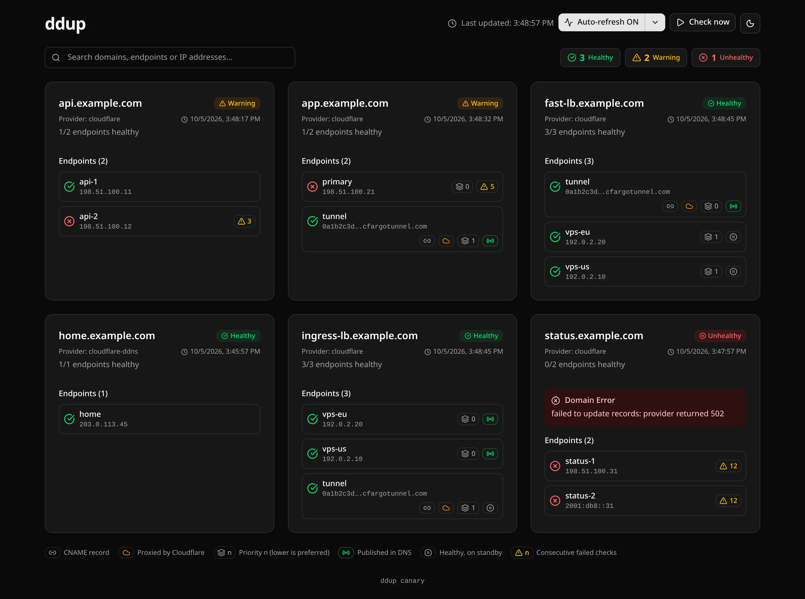
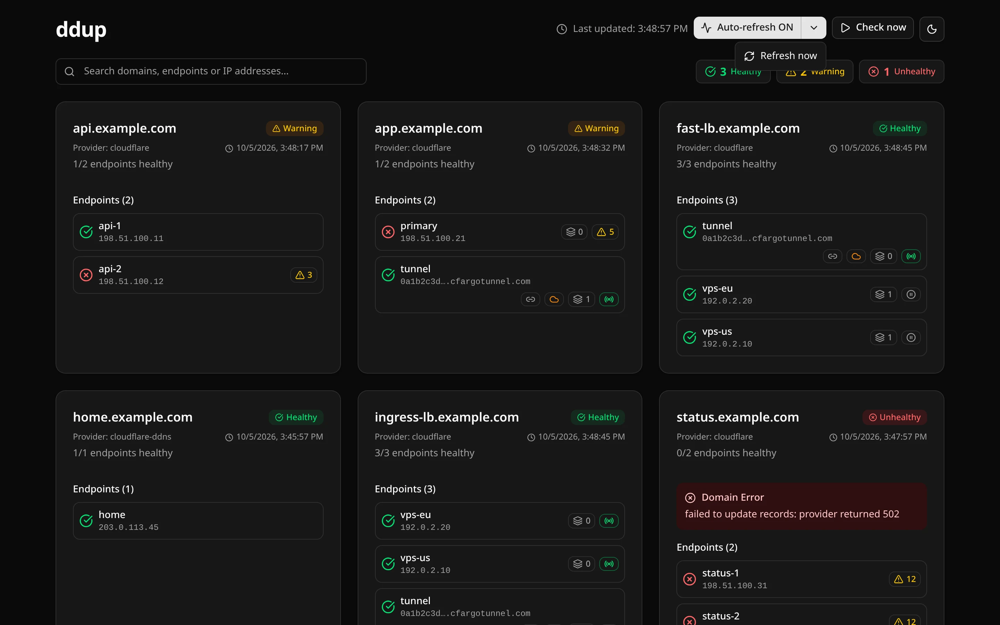
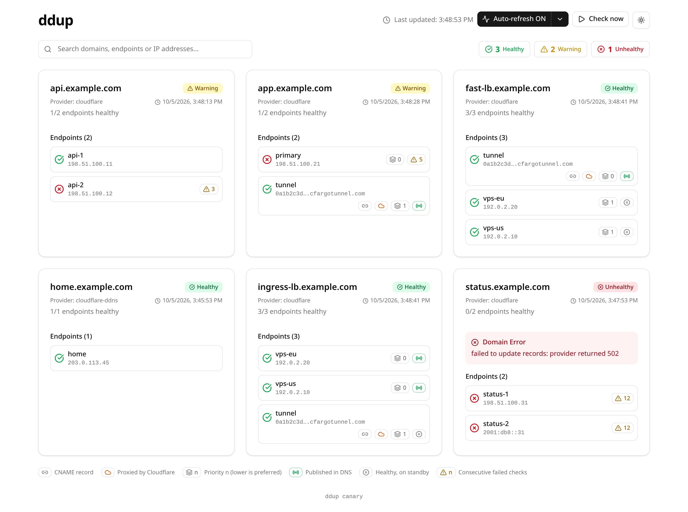
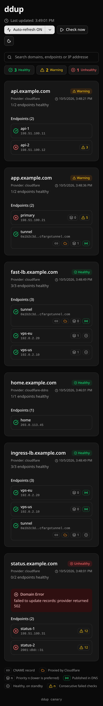
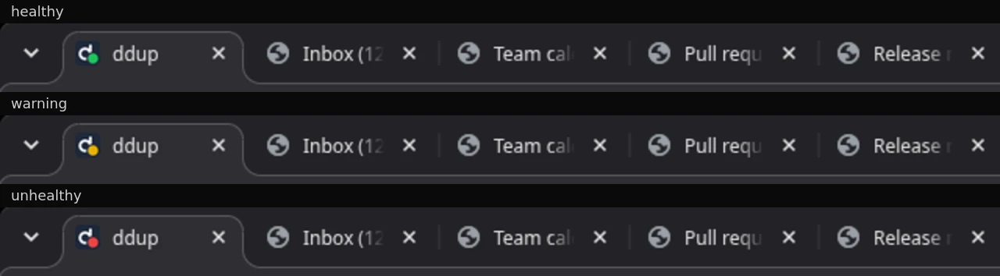
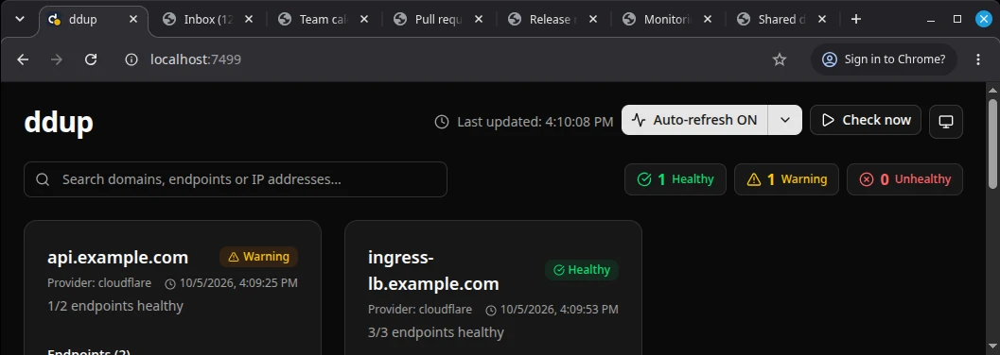

# What this fork adds

This fork of [ItalyPaleAle/ddup](https://github.com/ItalyPaleAle/ddup) carries features that are not (yet) upstream.
Everything shown below is sample data: `example.com` names, documentation IP addresses (`192.0.2.0/24`, `198.51.100.0/24`, `203.0.113.0/24`, `2001:db8::/32`), and a made-up tunnel ID.
[`UPSTREAM.md`](UPSTREAM.md) tracks what has been submitted upstream.
[`config.sample.yaml`](config.sample.yaml) documents every option.

## Dashboard

Each endpoint row shows what ddup publishes and why:

- **Failover priorities.** Only the healthy endpoints with the lowest priority are published; ddup falls back to the next priority when none are healthy. The row shows the priority, and whether the endpoint is published in DNS or healthy on standby (see `fast-lb` and `ingress-lb`).
- **CNAME and proxied targets.** An endpoint can publish a CNAME, optionally proxied by Cloudflare, for example a Cloudflare Tunnel as the last resort (`app` has failed over to its tunnel).
- **Dynamic DNS.** A record can follow the public IP address of the network ddup runs in (`home`).
- **Failed check counts and domain errors.** The warning badge on an endpoint is its number of consecutive failed checks. A domain that can't be updated shows the provider error (`status`).
- **Legend.** The footer explains every icon, and shows the version of the build.

### Summary, search and controls

The pills next to the search bar count healthy, warning and unhealthy domains.
**Check now** runs all health checks immediately, and the split button controls auto-refresh.
The last button cycles the theme between system, light and dark.

### Light theme

### Small screens

### Tab icon

The icon of the browser tab carries the overall status: a green badge when everything is healthy, yellow when something has a warning, and red when something is unhealthy.
With many tabs open the page title is cut off, but the icon still shows whether anything needs attention.
These are screenshots of a real Chrome window with seven tabs.

## Not visible in the dashboard

- **Health check options.** `method`, `expectStatus` and `recoverAfter` (consecutive successes before an endpoint is added back).
- **Webhooks.** Called on `dns_updated`, `dns_update_failed` and `all_unhealthy`, with templated headers and body, retries, and the domain's health status for templates (for example to set an ntfy tag). The sample config shows ntfy and an HTTP email API.
- **Secrets from the environment or files.** `!env NAME` and `!file /path` for provider settings, webhook URLs and headers, and `recordName`; `{{ env "NAME" }}` in webhook templates. This keeps the config file free of credentials, and lets values you don't want in git, such as a domain name, come from a Secret.

## Regenerating the screenshots

The images come from the dashboard's `dashboarddev` mode, which serves static data instead of running health checks (`cmd/ddup/main_dashboarddev.go`).
To regenerate them, replace the mock data with the example values listed at the top of this page, build with `-tags dashboarddev`, and capture the page with a headless browser. Don't commit that data change.
Never take screenshots from a real deployment: they would show real names and addresses.
